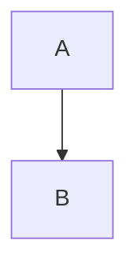
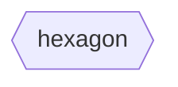
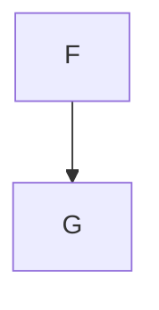

text


```mermaid
graph TD
  A-->B
```

* item

  ```mermaid
  graph LR
    C-->D
  ```
* next


```mermaid
graph TD
  E{{hexagon}}
```

<details><summary>diagram</summary>


```mermaid
graph TD
  F-->G
```

</details>
